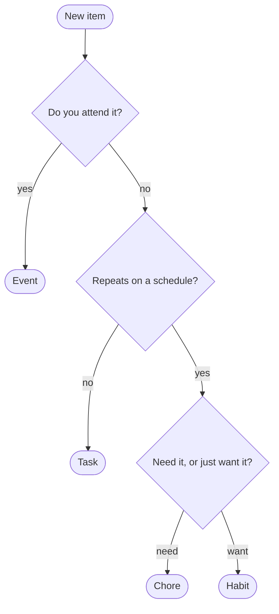

# Deferno MCP Server

An [MCP](https://modelcontextprotocol.io) server that exposes the Deferno
task-manager backend to AI agents.

MCP is the open standard used by Claude Desktop / Claude Code, Cursor,
Windsurf, Zed, VS Code Copilot agents, Continue, OpenAI Agents, and others,
so this server works with any of them — you configure it once in your
client and every tool and resource below becomes available.

## What the agent can do

### Reading items (kind-neutral)

Reads are **kind-neutral**: one set of tools spans Tasks, Habits, Chores, and
Events. Every read returns a **Compact projection** by default — a small fixed
field set chosen so reads don't flood the agent's context — and accepts
`full=true` to get the complete record instead.

| Tool           | Purpose                                                                          |
| -------------- | -------------------------------------------------------------------------------- |
| `get_item`     | Fetch ONE item (any kind) by any [Ref input form](#ref-input-forms)              |
| `list_items`   | Bounded, kind-neutral list backed by `GET /items` (filters + `limit` + `window`) |
| `search_items` | Compact full-text search over items                                              |

> **Removed:** the old task-list tools `list_tasks`, `get_task`, and
> `search_tasks` are **gone**. Use the kind-neutral `list_items` / `get_item` /
> `search_items` above instead. (Their `defernowork://tasks` and
> `defernowork://task/{task_id}` resources were removed too — see the
> [Resources](#resources) table.)

**`get_item(item, full=False, as_alias=False)`** — fetch a single item by any
[Ref input form](#ref-input-forms). Compact projection by default (single-item
compact keeps `description`); `full=true` returns the complete record (action
history, comments, children, mood, attachments…). `as_alias=true` forces the
by-alias lookup for ambiguous external strings (e.g. `ABC-223`) that the
classifier deliberately won't auto-route.

**`list_items(kind=, status=, from_date=, to_date=, limit=, full=False, window=None)`**
— the canonical bounded list. `kind` / `status` / `from_date` / `to_date`
compose into an OData `$filter`; `limit` maps to `$top` (the backend caps it at
**500** by *rejecting* larger values with a 400 — it does not silently clamp);
`full=true` returns full rows; `window="all"` opts out of the default
done-visibility window for full history. Compact list rows are narrower than
`get_item` — roughly `ref`, `kind`, `title`, `status`, `complete_by`,
`parent_id`, `labels`, with the body dropped.

**`search_items(query, status=, label=, from_date=, to_date=, parent_id=, full=False)`**
— compact full-text search; output is the same narrow Compact projection as
`list_items` (`full=true` for full rows). Note: full-text is **Tasks-only** in
the backend today (a kind-neutral `/items/search` is a known backend follow-on);
use `list_items` to enumerate non-Task kinds.

### Creating items (behavioral capture)

Creation is **caller-categorized**: the agent answers a few jargon-free,
behavioral questions and the server **deterministically derives** the item kind
(Task / Habit / Chore / Event) and builds the kind-specific payload. The agent
never names a Deferno kind — it describes how the thing *behaves*, and the
derivation does the rest. There is no inference and no model call on this path;
the kind is read straight off the discriminators.

Two rules keep the discriminators honest:

- **Date and time-of-day are orthogonal operands, never kind signals.** Every
  kind carries a time-of-day — a deadline for Task/Chore/Habit, a start for
  Event — so "has a set time" cannot decide the kind. (See the unified-WHEN model
  in the Deferno backend: every kind gained an explicit time-of-day field.)
- **Source never votes on kind.** An item synced from GitHub, Microsoft, or
  Google Calendar can be any of the four kinds; external provenance is orthogonal
  to the kind decision.

#### Kind-derivation tree



`Event` short-circuits first: a thing you attend is an Event whether or not it
repeats (a weekly stand-up is still an Event). `need` vs `want` is only asked
*once we know it recurs* — every one-off (want **or** need) is a **Task**. The
`need`/`want` split is the same obligation-vs-aspiration distinction the backend
encodes as *carries-forward* (Chore) vs *lapses* (Habit).

#### Truth table

| Example                   | Attend? | Repeats? | Need / want | → Kind    |
| ------------------------- | ------- | -------- | ----------- | --------- |
| Weekly team stand-up      | yes     | —        | —           | **Event** |
| Dentist appointment Tue   | yes     | —        | —           | **Event** |
| Pay rent every month      | no      | yes      | need        | **Chore** |
| Meditate daily            | no      | yes      | want        | **Habit** |
| File taxes by Apr 15      | no      | no       | —           | **Task**  |
| Read this novel (one-off) | no      | no       | —           | **Task**  |

### Other tools

| Tool                  | Purpose                                                      |
| --------------------- | ----------------------------------------------------------- |
| `start_auth`          | Begin browser-based login (returns a URL + session ID)      |
| `complete_auth`       | Exchange the browser code for a saved token                 |
| `logout`              | Invalidate session and remove saved credentials             |
| `whoami`              | Return the currently authenticated user                     |
| `create_task`         | Create a new task (optionally nested under a parent)        |
| `update_task`         | Patch any mutable field (title, description, status, mood…) |
| `set_task_status`     | Convenience wrapper for `open`/`in-progress`/`done`/…       |
| `move_item`           | Reparent or reorder any item (Task/Chore/Habit/Event)       |
| `split_task`          | Decompose a task into two child tasks                       |
| `fold_task`           | Insert a next-step task into the sibling chain              |
| `merge_task`          | Roll a parent's active children back into the parent        |
| `convert_item`        | Convert an item to a different kind (Task/Chore/Habit/Event)|
| `capture_item`        | Create any item by behavior → Task/Chore/Habit/Event (the create front door; see [Creating items](#creating-items-behavioral-capture)) |
| `get_daily_plan`      | Today's curated daily plan (recurring + carried forward)    |
| `get_items_plan`      | Daily plan across all item kinds (polymorphic)              |
| `add_to_items_plan` / `remove_from_items_plan` / `reorder_items_plan` | Manage the daily plan ordering |
| `get_items_calendar`  | Calendar view across all item kinds                         |
| `get_mood_history`    | Mood log for finished tasks                                 |

Kind-specific **mutations** (`update_*`, `delete_*`, occurrence tools,
attachment tools, etc.) accept any [Ref input form](#ref-input-forms) for their
item-id arguments — [Transparent resolution](#ref-input-forms) resolves the ref
to a UUID before the backend call runs. (This is the full list trimmed for
brevity; every kind — Task, Habit, Chore, Event — has its own create/update/
delete and occurrence/attachment tools.)

### Ref input forms

Anywhere a tool names a single item (and the `defernowork://item/{ref}`
resource), the MCP accepts any **Ref input form** and resolves it to a UUID
before acting — the agent never has to know which form it holds
(*Transparent resolution*). The recognised forms are:

| Form                  | Example                                                       | Notes                                              |
| --------------------- | ------------------------------------------------------------ | -------------------------------------------------- |
| **UUID**              | `b1c2…`                                                       | passed straight through (no lookup)                |
| **Sequence shorthand**| `#123` or bare `123`                                          | resolves against your **personal org only**        |
| **Canonical ref**     | `acme-123`, `u-1y0e2v-123`                                    | resolves across orgs                               |
| **App URL**           | `https://app.defernowork.com/o/{org_slug}/items/{seq-or-id}` | paste verbatim; resolves across orgs               |
| **GitHub alias**      | `owner/repo#N`                                                | auto-routes to by-alias (External tasks feature)   |

A *bare* `#N` always means a Deferno Sequence shorthand here — it is **not**
inferred as a GitHub issue. Ambiguous strings like `ABC-223` collide with a
Canonical ref and are **not** auto-routed; use `get_item(item, as_alias=true)`
to force the alias path. (Resolving the Deferno-`#` vs GitHub-`#` ambiguity from
conversation is the job of a future context-adaptive classifier — see
`CONTEXT.md` and `docs/adr/0001-transparent-ref-resolution.md`.)

### Resources

(readable by MCP clients that index resources)

| URI                                | Content                                                       |
| ---------------------------------- | ------------------------------------------------------------- |
| `defernowork://tasks/plan`         | Today's curated daily plan                                    |
| `defernowork://tasks/mood-history` | Mood log for finished tasks                                   |
| `defernowork://item/{ref}`         | A single item by any [Ref input form](#ref-input-forms) (Compact) |

The unbounded `defernowork://tasks` (all-tasks) and UUID-only
`defernowork://task/{task_id}` resources were **removed** (per ADR-0002):
unbounded reads flood agent context, and the any-ref `defernowork://item/{ref}`
above supersedes the single-task resource.

## Install

The easiest way is [`uvx`](https://docs.astral.sh/uv/) — it runs the package
in an isolated environment without a manual install step:

```bash
uvx defernowork-mcp
```

Or install permanently:

```bash
pip install defernowork-mcp
# or with uv:
uv pip install defernowork-mcp
```

## Authenticate

Run the one-time auth command:

```bash
defernowork-mcp auth --base-url https://app.defernowork.com/api
```

This opens a browser-based login flow:

1. A URL is printed — open it in your browser
2. Sign in (or approve if already signed in)
3. A short code is shown — paste it back into the terminal

Your token is saved to `~/.config/defernowork/credentials.json` and
loaded automatically on future runs. No env vars needed.

Alternatively, set `DEFERNO_TOKEN` as an environment variable to skip the
interactive flow (useful for CI or containers).

## Authentication flow

The auth flow works the same whether triggered from the CLI
(`defernowork-mcp auth`) or from within an agent (the `start_auth` /
`complete_auth` MCP tools). Three backend endpoints coordinate the
handshake:

```
MCP / CLI                  Backend                     Browser
  |                          |                           |
  |-- POST /auth/cli/init -->|                           |
  |<-- {session_id, url} ----|                           |
  |                          |                           |
  |  (user opens url)        |                           |
  |                          |<--- GET /cli-auth?s=...---|
  |                          |                           |
  |                          |   (user logs in if needed)|
  |                          |                           |
  |                          |<- POST /auth/cli/approve -|
  |                          |   {session_id}            |
  |                          |-- {code} ---------------->|
  |                          |   (browser shows code)    |
  |                          |                           |
  |  (user pastes code)      |                           |
  |                          |                           |
  |-- POST /auth/cli/verify->|                           |
  |   {session_id, code}     |                           |
  |<-- {token, user} --------|                           |
  |                          |                           |
  |  (token saved to disk)   |                           |
```

### Backend endpoints

| Endpoint | Auth | Request | Response |
| --- | --- | --- | --- |
| `POST /auth/cli/init` | none | `{}` | `{session_id: string, auth_url: string}` |
| `POST /auth/cli/approve` | Bearer | `{session_id: string}` | `{code: string}` |
| `POST /auth/cli/verify` | none | `{session_id: string, code: string}` | `{token: string, user: {id, username, …}}` |

**`cli/init`** creates a pending CLI session in Redis with a short TTL
(~10 minutes) and returns a URL the user should open in their browser.

**`cli/approve`** is called by the frontend after the user is logged in.
It creates a **new** backend session for the CLI (including the cached
DEK so encrypted task data remains accessible), generates a short
one-time code, and stores both in the CLI session record. The browser
session and CLI session are independent — logging out of one does not
affect the other.

**`cli/verify`** is called by the MCP server / CLI. It looks up the
CLI session, verifies the code, returns the session token and user info,
and deletes the CLI session record from Redis.

### Token resolution order

When the MCP server needs a token it checks, in order:

1. Per-request `Authorization: Bearer` header (HTTP transport only)
2. `DEFERNO_TOKEN` environment variable
3. Saved credentials at `~/.config/defernowork/credentials.json`

### Agent-driven flow

When an agent (Claude Code, Cursor, etc.) calls any tool and gets a 401,
the server instructions tell it to:

1. Call `start_auth` — returns `{auth_url, session_id}`
2. Show the URL to the user and ask them to sign in
3. Ask the user to paste the code shown in their browser
4. Call `complete_auth(session_id, code)` — saves credentials to disk

All subsequent tool calls work automatically, including across restarts.

## Configure

Environment variables:

| Variable            | Default                 | Purpose                                        |
| ------------------- | ----------------------- | ---------------------------------------------- |
| `DEFERNO_BASE_URL`  | `http://127.0.0.1:3000/api` | URL of the Deferno backend HTTP API (must include `/api` prefix) |
| `DEFERNO_TOKEN`     | _(unset)_               | Pre-existing bearer token; skips browser login |
| `DEFERNO_LOG_LEVEL` | `WARNING`               | Python logging level                           |

## API envelope versions

The MCP server intentionally speaks **both** `0.1` and `0.2` of the Deferno API
envelope. This is **forward-prep**: the backend has not cut over yet — it still
emits `0.1` today — and accepting `0.2` now means the MCP keeps working
unchanged the moment an imminent `0.2` cutover lands (and during any partial
rollout where both shapes are in flight). No client-side configuration is
needed — `DefernoClient` accepts either envelope and unwraps `data` the same
way. The set is defined as `SUPPORTED_API_VERSIONS` in
`src/defernowork_mcp/client.py`; once the backend has settled on `"0.2"` and
rollback to `"0.1"` is no longer plausible, drop `"0.1"` from the frozenset.

## Client configuration snippets

### Claude Desktop / Claude Code (Interactive method)

Add Deferno's MCP server to Claude's MCP configuration using the command line:

```bash
claude mcp add --transport http deferno https://app.defernowork.com/mcp
```

Or add to your MCP client settings (`claude_desktop_config.json` on
Claude Desktop, or Claude Code's `mcpServers` config):

```json
{
  "mcpServers": {
    "deferno": {
      "command": "uvx",
      "args": ["defernowork-mcp"],
      "env": {
        "DEFERNO_BASE_URL": "https://app.defernowork.com/api"
      }
    }
  }
}
```


### Headless or mcporter (Token method)

If you prefer to skip the interactive flow, or you are running in a headless/SSH
environment, provide a token directly. First, generate the MCP Personal access tokens through
Deferno's Settings/Interactions page, then paste it into the config:

```json
{
  "mcpServers": {
    "deferno": {
      "command": "uvx",
      "args": ["defernowork-mcp"],
      "env": {
        "DEFERNO_BASE_URL": "https://app.defernowork.com/api",
        "DEFERNO_TOKEN": "..."
      }
    }
  }
}
```

## Development

Syntax / import sanity check:

```bash
python -c "from defernowork_mcp.server import create_server; create_server()"
```

`src/defernowork_mcp/server.py` wires the server (auth, OAuth, resources) and
delegates the tool surface to per-area modules under
`src/defernowork_mcp/tools/` (e.g. `items.py`, `tasks.py`, `chores.py`,
`habits.py`, `events.py`, …), each exposing a `register(mcp, get_client,
format_error, …)` entry point. A thin async HTTP client
(`src/defernowork_mcp/client.py`), credential storage
(`src/defernowork_mcp/credentials.py`), and the shared Ref classifier/resolver
(`src/defernowork_mcp/refs.py`) round it out. Adding a new tool is a matter of
wrapping a new client method in an `@mcp.tool()` inside the relevant `tools/`
module; any id argument should be run through `resolve_ref` so it accepts every
[Ref input form](#ref-input-forms).
